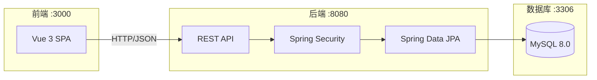
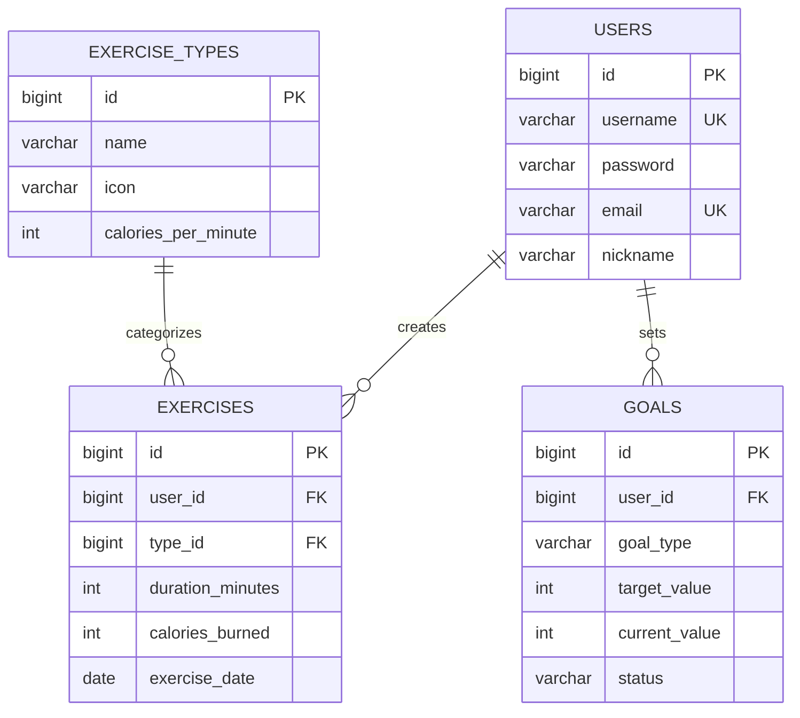

# 🏃 运动管理系统

> 一站式运动记录、目标追踪与数据分析平台

## 🛠 技术栈

| 层级 | 技术选型 |
|------|---------|
| Frontend | Vue 3 + Vite + Pinia + Vue Router |
| Backend | Spring Boot 3 + Spring Security + JWT |
| Database | MySQL 8.0 |
| Deploy | Docker + docker-compose |

## 🏗️ 系统架构



## 💾 数据库设计



## 🚀 快速启动

### 环境要求

- Docker Desktop (已启动)
- 无需本地安装 Node.js / Java / Maven

### ⚡ 一键启动

```bash
# 进入项目根目录

# 启动所有服务
docker compose up --build
```

等待约 2-3 分钟，容器启动完成后即可访问。

## 🔗 服务地址

| 服务 | 地址 |
|------|------|
| 前端页面 | http://localhost:3000 |
| 后端 API | http://localhost:8080 |
| 数据库 | localhost:3306 |

## 🧪 测试账号

| 角色 | 用户名 | 密码 |
|------|--------|------|
| 管理员 | admin | 123456 |
| 普通用户 | user | 123456 |

## 📱 核心功能

### 1. 用户认证
- ✅ 用户注册/登录
- ✅ JWT Token 认证
- ✅ 密码加密存储

### 2. 运动记录
- ✅ 12种运动类型（跑步、游泳、骑行等）
- ✅ 自动计算卡路里消耗
- ✅ 按日期查看记录
- ✅ 完整 CRUD 操作

### 3. 运动目标
- ✅ 三种目标类型（卡路里/时长/次数）
- ✅ 自动进度追踪
- ✅ 目标状态管理

### 4. 数据统计
- ✅ 仪表盘总览
- ✅ 卡路里消耗趋势图
- ✅ 运动类型分布图
- ✅ 周/月数据对比

### 5. 个人设置
- ✅ 个人信息修改
- ✅ 密码修改
- ✅ 安全退出

## 📂 项目结构

```
运动管理/
├── docker-compose.yml          # Docker 编排配置
├── README.md                   # 项目说明文档
│
├── backend/                    # 后端 Spring Boot
│   ├── Dockerfile
│   ├── pom.xml
│   └── src/main/java/com/sports/
│       ├── Application.java
│       ├── config/             # 配置类
│       ├── controller/         # 控制器
│       ├── dto/                # 数据传输对象
│       ├── entity/             # 实体类
│       ├── exception/          # 异常处理
│       ├── repository/         # 数据访问
│       ├── security/           # 安全配置
│       └── service/            # 业务逻辑
│
└── frontend/                   # 前端 Vue 3
    ├── Dockerfile
    ├── nginx.conf
    ├── package.json
    └── src/
        ├── main.js
        ├── App.vue
        ├── assets/styles/      # 样式
        ├── components/         # 公共组件
        ├── router/             # 路由配置
        ├── services/           # API 服务
        ├── stores/             # 状态管理
        └── views/              # 页面视图
```

## 🔧 专业工程实践

### 1. 日志系统
- ✅ 使用 SLF4J + Logback
- ✅ 结构化日志输出
- ✅ 关键业务操作日志记录

### 2. 错误处理
- ✅ 全局异常处理器 `GlobalExceptionHandler`
- ✅ 统一 API 响应格式 `ApiResponse`
- ✅ 前端 Toast 错误提示
- ✅ 前端 Error Boundary

### 3. 数据校验
- ✅ 后端 Bean Validation（@NotBlank, @Email 等）
- ✅ 前端表单验证
- ✅ DTO 严格类型定义

### 4. 接口设计
- ✅ RESTful 风格 API
- ✅ JWT 无状态认证
- ✅ CORS 跨域配置

### 5. 生产级特性

| 特性 | 状态 |
|------|------|
| 响应式设计 | ✅ |
| 数据持久化 | ✅ |
| 模块化架构 | ✅ |
| 密码加密 | ✅ |
| 健康检查 | ✅ |
| Docker 部署 | ✅ |

## 📝 API 接口文档

### 认证接口
| 方法 | 路径 | 描述 |
|------|------|------|
| POST | /api/auth/register | 用户注册 |
| POST | /api/auth/login | 用户登录 |

### 用户接口
| 方法 | 路径 | 描述 |
|------|------|------|
| GET | /api/users/me | 获取当前用户 |
| PUT | /api/users/me | 更新个人信息 |
| PUT | /api/users/me/password | 修改密码 |

### 运动接口
| 方法 | 路径 | 描述 |
|------|------|------|
| GET | /api/exercise-types | 获取运动类型 |
| GET | /api/exercises | 获取运动列表 |
| POST | /api/exercises | 添加运动记录 |
| PUT | /api/exercises/{id} | 更新运动记录 |
| DELETE | /api/exercises/{id} | 删除运动记录 |

### 目标接口
| 方法 | 路径 | 描述 |
|------|------|------|
| GET | /api/goals | 获取目标列表 |
| POST | /api/goals | 创建目标 |
| PUT | /api/goals/{id} | 更新目标 |
| DELETE | /api/goals/{id} | 删除目标 |

### 统计接口
| 方法 | 路径 | 描述 |
|------|------|------|
| GET | /api/stats/overview | 总览统计 |
| GET | /api/stats/weekly | 周统计 |
| GET | /api/stats/monthly | 月统计 |
| GET | /api/stats/trend | 趋势数据 |
| GET | /api/stats/distribution | 类型分布 |

---

**开发者**: AI Assistant  
**版本**: v1.0.0
